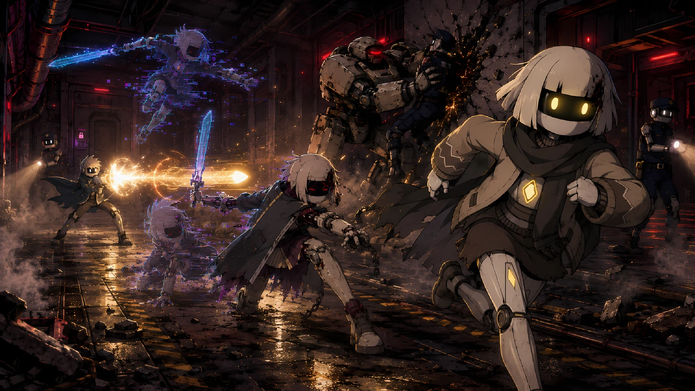
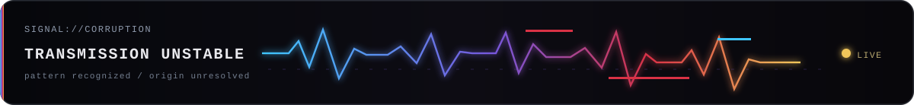
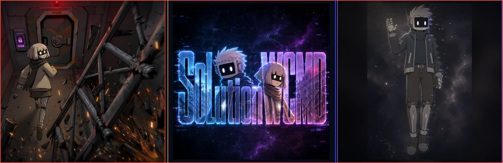

<!--
  Public organization profile for Solution-WCMD.
  GitHub renders this file from .github/profile/README.md.
-->

  

  <a href="https://www.solutionwcmd.com/"><strong>Website</strong></a>
  &nbsp;·&nbsp;
  <a href="https://www.youtube.com/@SolutionWCMD"><strong>YouTube</strong></a>
  &nbsp;·&nbsp;
  <a href="#the-universe"><strong>The universe</strong></a>
  &nbsp;·&nbsp;
  <a href="#public-entry-points"><strong>Public repositories</strong></a>
  &nbsp;·&nbsp;
  <a href="#contributing"><strong>Contributing</strong></a>

  
  
  
  

## SolutionWCMD is the universe. *Solution* is the game.

**SolutionWCMD** is an original narrative universe built across interactive stories, visual development, standalone experiences, reusable technology, and connected web services. Its central project, **Solution**, is a story-driven 2D horror adventure where charm, mystery, and occasional humor meet isolation, pursuit, and a corruption that can rewrite machines, bodies, memory, and reality.

Deep beneath a ruined surface, **Vey** and **Nait** are trapped in a bunker built as a sanctuary and enforced as a prison. Their attempt to escape becomes a search for truth about the bunker, their past, and the presence that appears to be guiding them.

  Official SolutionWCMD project key art.

  <strong>Stealth and puzzles</strong>
  &nbsp;·&nbsp;
  <strong>Pursuit sequences</strong>
  &nbsp;·&nbsp;
  <strong>Close combat</strong>
  &nbsp;·&nbsp;
  <strong>Environmental storytelling</strong>
  &nbsp;·&nbsp;
  <strong>Psychological horror</strong>

  

## More than one executable

The universe is developed as one connected production rather than a collection of disconnected outputs.

- **Narrative and canon:** characters, locations, continuity, world rules, dialogue, scene intent, and long-form story architecture.
- **Playable production:** player control, puzzles, stealth, pursuit, combat, camera language, pacing, audio, and scene implementation.
- **Visual development:** canon-faithful characters, environments, props, UI, illustrations, animation, and production references.
- **Technology and platform:** Unity foundations, project-specific tooling, web experiences, backend services, automation, documentation, and release infrastructure.
- **Public experiences:** selected packages, experiments, game-jam work, and platform components that can stand on their own.

  

## One connected production

Story, art, and implementation are not treated as isolated handoffs. Narrative scenes are evaluated against player agency, pacing, interaction, camera behavior, animation, and engine constraints. Visual work follows approved references so that characters and environments remain consistent across illustrations, sprites, UI, and playable scenes. Reusable systems support the production without replacing project-specific direction.

  

  Selected visual-development material from the SolutionWCMD reference library, including the current brand logo artwork.

## Public entry points

The core game, narrative, art-production, and internal infrastructure repositories remain private while they are actively developed. The public repositories expose reusable foundations, selected experiences, and the platform surrounding the universe.

| Repository | Purpose | Main technology |
| --- | --- | --- |
| [**Solution.Common**](https://github.com/Solution-WCMD/SolutionWCMD-Common) | Reusable Unity foundation with shared utilities, patterns, abstractions, documentation, releases, and UPM installation. | `C#` · `Unity` |
| [**Duke Recovery**](https://github.com/Solution-WCMD/SolutionWCMD-DukeRecovery) | Keyboard-first, terminal-aesthetic puzzle experience created for the Together Java Game Jam and designed to exist inside the Solution universe. | `Java 21` · `Gradle` · `Swing` |
| [**SolutionWCMD Frontend**](https://github.com/Solution-WCMD/SolutionWCMD-Frontend) | Public web presence and presentation layer for the SolutionWCMD universe. | `Angular` · `TypeScript` |
| [**SolutionWCMD Email Microservice**](https://github.com/Solution-WCMD/SolutionWCMD-EmailMicroservice) | Focused, stateless service for validated contact and application requests, packaged for containerized deployment. | `Java 21` · `Javalin` · `Docker` |

## Technology across the universe

**Game and interactive production**

  
  
  
  
  

**Web, services, and delivery**

  
  
  
  
  
  

## Production principles

1. **Canon remains a source of truth.** Character, world, and scene decisions stay traceable to approved narrative and visual references.
2. **A scene must work as a game.** Strong prose is not enough if the result fails under player control, pacing, interaction, camera, or engine limits.
3. **Visual identity is preserved.** Existing designs are reproduced faithfully instead of being casually reinterpreted between assets.
4. **Shared systems earn their abstraction.** Reusable tooling should remove repeated work without burying an independent production in ceremony.
5. **Public work should be useful on its own.** Open packages and experiences are documented, versioned, and maintained as real projects.

## Contributing

Contribution rules, target branches, and licenses are repository-specific. Before beginning substantial work, open an issue in the relevant public repository so scope and direction can be aligned with the maintainers.

The characters, narrative, logo, illustrations, key art, and other original universe assets are project intellectual property. A public source-code license does not automatically grant rights to reuse those assets. See the [visual asset notice](../ASSET-NOTICE.md).

  
  

  

  SolutionWCMD, Solution, their characters, narrative, and original artwork are protected project assets. Code licenses are defined per repository.

